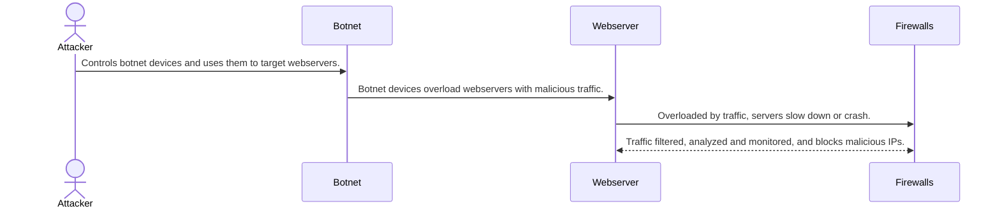

# Distributed Denial of Service Attacks (DDoS)

## How do DDoS attacks work?
1. Attack is initiated by threat actors who commands botnets to begin the DDoS attack.
2. Infected devices send large volumes of traffic through HTTP spam requests, ICMP packets, and more to their targeted webserver.
3. The servers begin to become overloaded. They either slow down to halt from the overwhelming amounts of traffic or crash completely.
4. The firewall first detects irregular traffic patterns. In response, it identifies potential suspicious behavior, rate-limits it, then blocks malicious IP addressses.
