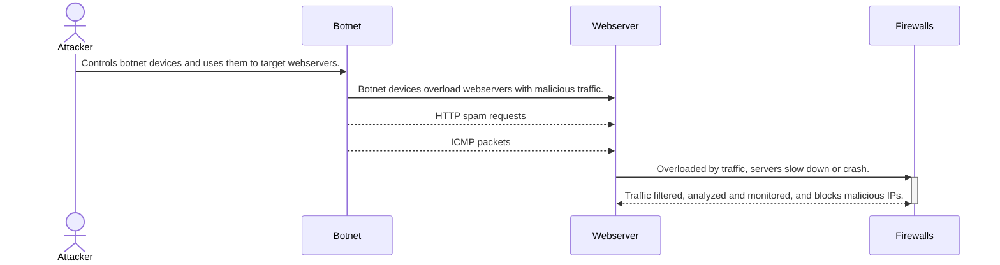

# Distributed Denial of Service Attacks (DDoS)

## How do DDoS attacks work?
1. Attack is initiated by _**threat actors**_ who commands _**botnets**_ to begin the DDoS attack.
2. Infected devices send large volumes of traffic through HTTP spam requests, ICMP packets, and more to their targeted _**webserver**_.
3. The servers begin to become overloaded. They either slow down to halt from the overwhelming amounts of traffic or crash completely.
4. The _**firewall**_ first detects irregular traffic patterns. In response, it identifies potential suspicious behavior, rate-limits it, then blocks malicious IP addressses.
5. Depending on the firewall's capabilities and the scale of the attack, the server could recover by blocking the traffic. If the extent of the attack exceeds the server's defense capabilities, it will remain overwhelmed.
